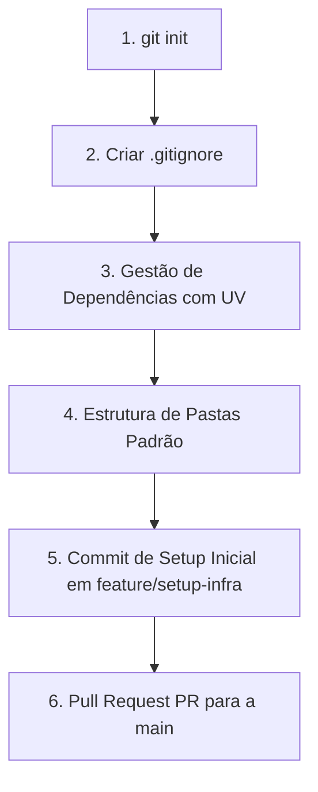

# Planejamento Estruturado: Testes, Git e Portfólio

Este documento organiza os próximos passos do projeto e serve como um **Guia Padrão de Inicialização de Projetos de Dados (ETL)**. Ele detalha as boas práticas e padrões da indústria para conduzir projetos de engenharia de software e dados desde o início.

---

## 1. Guia Padrão de Inicialização de Projetos de Dados (ETL)

Quando iniciamos um projeto de dados do zero, a organização de pastas, dependências e versionamento deve seguir uma ordem lógica rígida para evitar retrabalho e vazamento de dados locais no Git.



### Em qual branch fazer os primeiros commits de configuração e qual tipo usar?

Seguindo as boas práticas de mercado e de ambientes profissionais, **nunca devemos commitar diretamente na branch `main`**, mesmo no setup inicial do projeto (configuração de dependências, estruturas de pastas e arquivos de documentação). O correto é criar uma branch dedicada (como `feature/setup-infra` ou `chore/initial-setup`) e integrá-la através de um **Pull Request (PR)**. Isso garante a proteção de branches principais, facilita revisões de código e validações automáticas de CI/CD.

Os tipos de commits mais adequados segundo o padrão Conventional Commits para esse setup na branch de feature são:

| O que está sendo salvo | Branch de Origem | Tipo de Commit | Exemplo de Mensagem |
| :--- | :--- | :--- | :--- |
| Arquivo `.gitignore` | `feature/setup-infra` | `chore` | `chore: adiciona arquivo .gitignore inicial` |
| Dependências (`pyproject.toml`, `uv.lock`) | `feature/setup-infra` | `chore` (ou `chore(deps)`) | `chore: configura ambiente de dependencias com uv` |
| Arquivo `README.md` | `feature/setup-infra` | `docs` | `docs: adiciona README inicial com explicacao do projeto` |
| Estrutura de pastas vazias | `feature/setup-infra` | `chore` | `chore: cria estrutura de diretorios padrao (src, notebooks, data)` |

---

## 2. Estrutura de Pastas Padrão para Projetos de Dados
Para projetos de ETL, crie a seguinte árvore de diretórios:
```bash
mkdir -p data/raw data/processed db notebooks src tests scripts docs
```
* `data/raw/`: Dados brutos imutáveis vindos das fontes originais.
* `data/processed/`: Dados após limpeza, prontos para consumo.
* `db/`: Arquivos locais de banco de dados DuckDB.
* `src/`: Módulos de código reutilizáveis (Ingestão, Queries, Conexões).
* `tests/`: Testes automatizados.
* `scripts/`: Scripts orquestradores executáveis.

### O que colocar no `.gitignore` de um projeto de dados:
```text
# Ambientes virtuais e ferramentas de pacotes
.venv/
.ipynb_checkpoints/
__pycache__/

# Dados (Arquivos pesados e locais)
data/raw/
data/processed/
data/temp/
*.parquet
*.csv

# Bancos de dados locais
*.duckdb
*.db
*.sqlite

# Variáveis de ambiente e segredos
.env
```

---

## 3. O Papel do Notebook no Portfólio: Storytelling, Plots e Versionamento

Em repositórios públicos voltados para portfólio, o **Notebook é a sua vitrine**. Enquanto os scripts em `src/` e `scripts/` provam sua competência técnica de engenharia, o notebook prova sua capacidade de traduzir dados em insights de negócio.

### A importância de Gráficos (Plots) e Storytelling
* **Use Gráficos Interativos**: Prefira usar o `plotly` ou `seaborn` ao invés do básico `matplotlib`. Gráficos interativos impressionam mais porque permitem que o leitor passe o mouse e explore os dados.
* **Estrutura de Storytelling (Início, Meio e Fim)**:
  1. **A Pergunta/Hipótese (Markdown)**: Explique o que você quer descobrir. Ex: *"Será que corridas de aeroporto compensam mais por milha do que corridas urbanas comuns?"*
  2. **A Exploração (Código)**: Rode a query ou crie as colunas calculadas.
  3. **A Visualização (Gráfico)**: Apresente o gráfico gerado.
  4. **A Conclusão (Markdown)**: Resuma o achado em termos de negócio. Ex: *"Apesar das corridas para o JFK terem tarifas mais altas, o trânsito pesado na hora de pico reduz o faturamento por hora a níveis inferiores às corridas comuns"*.

### Boas Práticas de Versionamento de Notebooks no Git
* **SEMPRE limpe os outputs antes de fazer commit**:
  * Vá no menu **Kernel -> Restart & Clear Output** antes de dar `git add`.
  * **Por quê?** Salvar gráficos interativos pesados ou tabelas HTML infla o tamanho do arquivo `.ipynb`, consome armazenamento no Git e polui o histórico de alterações (`git diff`), dificultando a revisão do seu código por outras pessoas.
* **Automação recomendada (`nbstripout`)**:
  * Para não esquecer de limpar os notebooks, instale e ative o `nbstripout` no seu repositório. Ele limpa as saídas automaticamente durante o commit:
    ```bash
    uv add nbstripout --dev
    uv run nbstripout --install
    ```

---

## 4. Status de Sincronismo do Projeto

### Diagnóstico de Sincronismo Atual:
Os arquivos do repositório estão **perfeitamente sincronizados** sob a arquitetura Medalhão:
1. **Camada Bronze (Raw)**: Ambos usam os dados reais de **Abril de 2026** (`yellow_tripdata_2026-04.parquet`).
2. **Camada Silver (Staging)**: O script `scripts/main.py` faz a limpeza inicial na função `clean_raw_data` e gera o arquivo `taxi_cleaned_2026_04.parquet`.
3. **Camada Gold (Analytics)**:
   * O notebook e o script compartilham a mesma lógica e fórmulas matemáticas para as métricas (Daily, Hourly, Airport, Payment e Speed).
   * No `main.py`, as queries analíticas foram otimizadas e limpas de filtros duplicados, consumindo diretamente o arquivo de staging limpo.

---

## 5. Estrutura e Arquitetura de Testes para Projetos de Dados

A arquitetura de testes em pipelines ETL garante que suas transformações de dados sejam confiáveis e reprodutíveis.

```text
duckdb-analytics/
└── tests/
    ├── __init__.py
    ├── conftest.py          # Fixtures globais do pytest (ex: conexão DuckDB de teste)
    ├── test_ingestion.py    # Valida download e leitura dos dados brutos
    └── test_transform.py    # Valida queries de agregação e limpeza
```

### O papel do `conftest.py` (Fixtures do PyTest)
O `conftest.py` é usado para criar dados fictícios na memória (Mock Data) e compartilhar recursos entre os testes sem poluir o código.
* **Exemplo de conexão DuckDB para testes**:
  ```python
  import pytest
  import duckdb
  
  @pytest.fixture(scope="function")
  def temp_db_conn():
      """Gera uma conexão limpa em memória para cada função de teste."""
      conn = duckdb.connect(":memory:")
      yield conn
      conn.close()
  ```

---

## 6. Granularidade: Feature (Branch) vs. Commit

Para manter o histórico legível por recrutadores no seu portfólio, adote esta regra de granularidade:

### A Branch (Feature)
Representa **uma entrega completa** de negócio ou alteração estrutural.
* *Exemplo:* `feature/streamlit-dashboard`

### O Commit
Representa **um passo atômico e funcional** para atingir o objetivo da branch.
* *Mensagens padrão no Imperativo (Conventional Commits):*
  * `feat(pipeline): adiciona calculo de velocidade media`
  * `test(pipeline): valida tratamento de datas nulas`
  * `docs(readme): adiciona guia de instalacao local`

---

## 7. Próximos Passos (Workflow Recomendado)

Siga este checklist estruturado para avançar no desenvolvimento:

### Fase 1: Finalizar a Branch Atual (`feature/setup-and-analysis`)
- [ ] Adicionar e comitar as alterações feitas no notebook (`01_exploratory_analysis.ipynb`) no imperativo (lembrando de limpar outputs!).
- [ ] Adicionar e comitar a pasta `scripts/` (contendo o script `main.py`).
- [ ] Mesclar a branch na `main` localmente ou via GitHub PR.

### Fase 2: Configurar a Infraestrutura de Testes
- [ ] Criar a branch `chore/test-infrastructure`.
- [ ] Instalar o `pytest` (`uv add pytest --dev`).
- [ ] Criar a pasta `tests/` e configurar o `conftest.py`.
- [ ] Mesclar na `main`.

### Fase 3: Modularizar o Código e Escrever Testes de Feature
- [ ] Criar a branch `feature/modularization-and-tests`.
- [ ] Mover as consultas SQL e conexões para a pasta `src/`.
- [ ] Escrever os testes unitários em `tests/test_transform.py` para validar as funções do `src/`.
- [ ] Mesclar na `main`.

### Fase 4: Visualização e Portfólio (Streamlit)
- [ ] Criar a branch `feature/dashboard-streamlit`.
- [ ] Instalar o streamlit (`uv add streamlit`).
- [ ] Criar o dashboard interativo lendo os Parquet de `data/processed/`.
- [ ] Escrever um `README.md` de alta qualidade com fotos do dashboard e resultados de performance.
- [ ] Publicar no GitHub público.
