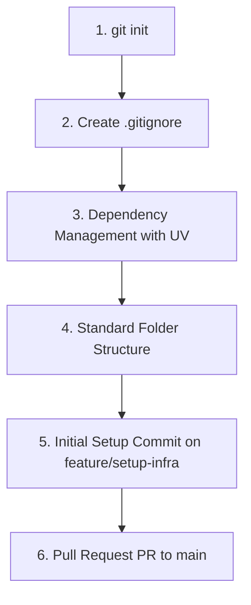

# Structured Planning: Testing, Git, and Portfolio

This document outlines project next steps and serves as a **Standard Guide for Data Project Initialization (ETL)**. It details industry best practices and standards for conducting software and data engineering projects from scratch.

---

## 1. Standard Data Project Initialization Guide (ETL)

When starting a data project from scratch, directory organization, dependency management, and versioning must follow a strict logical sequence to prevent rework and local data leaks in Git.



### Which branch to use for setup commits and which type?

Following market best practices and professional environment standards, **never commit directly to the `main` branch**, even during initial project setup (dependency configuration, directory creation, and documentation files). The correct approach is creating a dedicated branch (such as `feature/setup-infra` or `chore/initial-setup`) and integrating changes via **Pull Request (PR)**. This guarantees main branch protection and facilitates code reviews and automated CI/CD checks.

Recommended Conventional Commits types for setup on feature branches:

| Content Staged | Origin Branch | Commit Type | Example Message |
| :--- | :--- | :--- | :--- |
| `.gitignore` file | `feature/setup-infra` | `chore` | `chore: add initial .gitignore file` |
| Dependencies (`pyproject.toml`, `uv.lock`) | `feature/setup-infra` | `chore` (or `chore(deps)`) | `chore: setup dependencies environment with uv` |
| `README.md` file | `feature/setup-infra` | `docs` | `docs: add initial README explaining project` |
| Empty directory structure | `feature/setup-infra` | `chore` | `chore: create standard directory tree (src, notebooks, data)` |

---

## 2. Standard Folder Structure for Data Projects
For ETL projects, create the following directory tree:
```bash
mkdir -p data/raw data/processed db notebooks src tests scripts docs
```
* `data/raw/`: Immutable raw data from original sources.
* `data/processed/`: Cleansed data ready for consumption.
* `db/`: Local DuckDB database files.
* `src/`: Reusable code modules (Ingestion, Queries, Connections).
* `tests/`: Automated tests.
* `scripts/`: Executable orchestrator scripts.

### What to include in a Data Project's `.gitignore`:
```text
# Virtual environments and package tools
.venv/
.ipynb_checkpoints/
__pycache__/

# Heavy local data files
data/raw/
data/processed/
data/temp/
*.parquet
*.csv

# Local database files
*.duckdb
*.db
*.sqlite

# Environment variables and secrets
.env
```

---

## 3. Notebooks in Portfolios: Storytelling, Plots, and Versioning

In public portfolio repositories, the **Notebook is your showcase**. While scripts in `src/` and `scripts/` prove technical software engineering skills, notebooks demonstrate your capacity to translate data into business insights.

### Importance of Charts (Plots) and Storytelling
* **Use Interactive Plots**: Prefer `plotly` or `seaborn` over basic `matplotlib`. Interactive charts allow readers to hover and explore data.
* **Storytelling Structure**:
  1. **Question / Hypothesis (Markdown)**: State what you aim to discover. E.g., *"Do airport trips yield higher revenue per mile than standard urban trips?"*
  2. **Exploration (Code)**: Run queries or calculated columns.
  3. **Visualization (Chart)**: Present generated charts.
  4. **Conclusion (Markdown)**: Summarize findings in business terms. E.g., *"Although JFK trips carry higher fixed fares, peak traffic congestion reduces hourly earnings below standard trip rates."*

### Notebook Versioning Best Practices
* **ALWAYS clear outputs before committing**:
  * Navigate to **Kernel -> Restart & Clear Output** prior to running `git add`.
  * **Why?** Saving heavy interactive plots or HTML tables inflates `.ipynb` file size, consumes Git storage, and pollutes `git diff` history.
* **Recommended Automation (`nbstripout`)**:
  * Install and enable `nbstripout` in your repository to automatically strip outputs during commits:
    ```bash
    uv add nbstripout --dev
    uv run nbstripout --install
    ```

---

## 4. Project Sync Status

### Current Synchronization Diagnosis:
Repository files are **fully synchronized** under Medallion Architecture:
